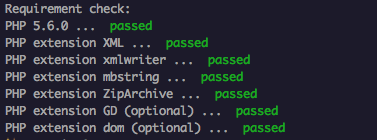

phpexcel-chart-sample
=======================

PHPSpreadsheetを使ったグラフの作成テスト。

## 初期化

```sh
composer install
```

## PHP拡張の確認

必要なPHP拡張があるかどうか確認。

```sh
yarn run check
# or
npm run check
```


全て `passed` ならOK。だめだったら homebrew とかでインストールしてください。

## サーバー起動

```sh
yarn run serve
# or
npm run serve
```

`http://localhost:8889` でアクセスできます。